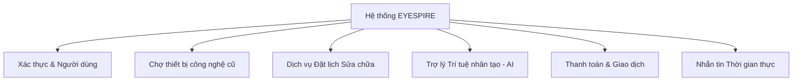

# Software Requirement Specification (SRS)
# EYESPIRE - Electronics Marketplace & Repair Platform

Tài liệu Đặc tả Yêu cầu Phần mềm (SRS) này mô tả toàn bộ các yêu cầu nghiệp vụ, chức năng và phi chức năng cho hệ thống **EYESPIRE** (trước đây là TechCycle) — Nền tảng thương mại điện tử thiết bị công nghệ cũ kết hợp dịch vụ đặt lịch sửa chữa và trợ lý trí tuệ nhân tạo (AI).

---

## 1. Giới thiệu (Introduction)

### 1.1 Mục đích (Purpose)
Tài liệu này định nghĩa chi tiết các yêu cầu kỹ thuật, luồng nghiệp vụ và giao diện của nền tảng **EYESPIRE**. Tài liệu được sử dụng làm cơ sở để phát triển sản phẩm, thiết kế cơ sở dữ liệu, kiểm thử phần mềm (QA/QC) và nghiệm thu dự án.

### 1.2 Phạm vi hệ thống (Scope)
**EYESPIRE** là một nền tảng Web tích hợp hướng tới giải quyết nhu cầu tiêu dùng công nghệ bền vững thông qua 3 trụ cột dịch vụ:
1. **Chợ mua bán đồ cũ (Electronics Marketplace)**: Hỗ trợ người dùng đăng bán thiết bị cũ và khách hàng tìm mua với các tính năng giỏ hàng, đặt hàng, quản lý đơn hàng.
2. **Dịch vụ đặt lịch sửa chữa (Repair Booking Platform)**: Cho phép khách hàng gửi yêu cầu sửa chữa, hẹn giờ, tự động phân công kỹ thuật viên (Technician), theo dõi tiến độ sửa chữa theo thời gian thực.
3. **Trợ lý Trí tuệ Nhân tạo (AI Integration)**:
   - **Tư vấn bán hàng (Chatbot Client)**: Phục vụ khách hàng dựa trên dữ liệu sản phẩm có sẵn tại hệ thống để đề xuất sản phẩm và chỉ dẫn đặt mua.
   - **Tư vấn kỹ thuật (Chatbot Troubleshooting)**: Hỗ trợ chẩn đoán sự cố dựa trên cơ sở tri thức có sẵn (`repair_knowledge`) kết hợp mô hình AI ngôn ngữ lớn (Gemini).
   - **Định giá sản phẩm tự động (AI Valuation)**: Phân tích độ mới, tính trạng để gợi ý khoảng giá sàn/trần cho người đăng bán.
   - **Chẩn đoán mức độ hỏng hóc (AI Damage Assessment)**: Phân tích mô tả sự cố thiết bị của khách hàng để gợi ý mức độ nghiêm trọng (Light, Medium, Heavy) và chi phí ước tính.

### 1.3 Thuật ngữ & Viết tắt (Definitions, Acronyms, and Abbreviations)

| Thuật ngữ | Ý nghĩa |
|---|---|
| **SRS** | Software Requirement Specification (Đặc tả yêu cầu phần mềm) |
| **SDS** | Software Design Specification (Đặc tả thiết kế phần mềm) |
| **RBAC** | Role-Based Access Control (Kiểm soát truy cập dựa trên vai trò) |
| **ABAC** | Attribute-Based Access Control (Kiểm soát truy cập dựa trên thuộc tính) |
| **OTP** | One-Time Password (Mật khẩu sử dụng một lần để xác thực đăng ký/khôi phục) |
| **RAG** | Retrieval-Augmented Generation (Tìm kiếm tài liệu làm context cho AI) |
| **Dịch vụ bên thứ 3** | VNPay (Cổng thanh toán), SePay (Webhook đồng bộ giao dịch ngân hàng), Nodemailer (Dịch vụ gửi email) |

---

## 2. Mô tả tổng quan (Overall Description)

### 2.1 Bối cảnh hệ thống (Product Perspective)
EYESPIRE hoạt động theo mô hình Monorepo chứa 3 mô-đun chính:
- **Frontend**: Ứng dụng Web Single Page Application (SPA) xây dựng bằng ReactJS.
- **Backend (Core Server)**: Express.js API Gateway quản lý xác thực, cơ sở dữ liệu giao dịch chính (MS SQL Server qua Sequelize), tích hợp VNPay, SePay và gửi mail OTP.
- **Chatbot Server (Microservices)**: Hai cổng dịch vụ AI riêng biệt sử dụng Google Gemini API:
  - **Chatbot 1 (Port 3001)**: Đọc thông tin từ View database để trả lời thông tin sản phẩm và thợ kỹ thuật.
  - **Chatbot 2 (Port 3002)**: Đọc dữ liệu từ cơ sở tri thức lỗi để hướng dẫn khắc phục sự cố phần cứng.

### 2.2 Đối tượng sử dụng hệ thống (User Classes and Characteristics)
Hệ thống phân quyền truy cập thông qua 4 nhóm vai trò (Roles):
1. **Khách hàng (Customer)**: Tìm kiếm mua sắm sản phẩm cũ, chat với người bán, tạo yêu cầu sửa chữa, đặt lịch hẹn và thực hiện thanh toán online.
2. **Người bán / Cửa hàng (Seller)**: Đăng tải sản phẩm cũ cần thanh lý, quản lý kho hàng, thiết lập giá bán (có sự tham vấn từ AI), nhận đơn đặt hàng và giao dịch tài chính.
3. **Thợ sửa chữa (Technician)**: Nhận các lịch hẹn sửa chữa được phân công, cập nhật trạng thái tiến độ sửa máy và ghi chú kỹ thuật.
4. **Quản trị viên (Admin)**: Quản lý người dùng, quản trị danh mục sản phẩm/dịch vụ sửa chữa, phân công kỹ thuật viên hỗ trợ các ca sửa chữa phức tạp, theo dõi doanh thu tổng quát của hệ thống.

### 2.3 Môi trường vận hành (Operating Environment)
- **Client**: Trình duyệt Web hiện đại (Chrome, Safari, Edge, Firefox) trên cả thiết bị di động (Responsive) và Desktop.
- **Server**: Chạy trên môi trường Node.js LTS, kết nối hệ quản trị cơ sở dữ liệu Microsoft SQL Server (2019+).

### 2.4 Các ràng buộc đặc thù (Design and Implementation Constraints)
- **Tiền tệ**: Mặc định sử dụng Việt Nam Đồng (VND).
- **Số điện thoại**: Định dạng chuẩn mạng viễn thông Việt Nam (10 hoặc 11 chữ số, bắt đầu bằng đầu số `0`).
- **Xác thực**: Bắt buộc đăng ký tài khoản và kích hoạt bằng OTP gửi qua Email.
- **Bảo mật**: Mật khẩu của người dùng bắt buộc được băm bằng thuật toán `bcryptjs` tại tầng ứng dụng. Token phiên làm việc (JWT) được lưu trữ dưới dạng HttpOnly, Secure, SameSite Cookie để hạn chế tối đa các cuộc tấn công XSS/CSRF.

---

## 3. Yêu cầu chức năng chi tiết (Functional Requirements)

### 3.1 Quản lý Người dùng & Xác thực (User Management & Authentication)
- **Đăng ký tài khoản (Register)**:
  - Khách hàng điền thông tin: username, email, mật khẩu, họ tên, số điện thoại.
  - Hệ thống gửi mã OTP xác thực qua email đăng ký. Tài khoản chỉ được kích hoạt (`status = 'active'`) khi nhập chính xác OTP.
- **Đăng nhập (Login)**:
  - Cho phép đăng nhập bằng Username hoặc Email kèm Mật khẩu.
  - Hỗ trợ đăng nhập nhanh bằng tài khoản Google (OAuth2).
  - Trả về token JWT lưu dạng HttpOnly Cookie.
- **Quản lý Hồ sơ (Profile Management)**:
  - Cập nhật thông tin cá nhân: Ảnh đại diện (avatar), số điện thoại, địa chỉ nhận hàng/sửa chữa.
  - Phân loại hồ sơ tương ứng theo vai trò (Customer Profile, Seller Profile, Technician Profile).

### 3.2 Chợ Mua Bán Thiết Bị Cũ (Product Marketplace)
- **Đăng bán sản phẩm (Sellers)**:
  - Seller đăng bán thiết bị kèm tiêu đề, mô tả tình trạng, danh mục, hình ảnh (hỗ trợ nhiều ảnh, có chỉ định ảnh đại diện chính).
  - Tích hợp công cụ định giá AI tự động đưa ra giá trần và giá sàn gợi ý dựa trên mô tả sản phẩm của người bán.
  - Đặt giá bán thực tế (`listed_price`).
- **Tìm kiếm & Bộ lọc (Customers)**:
  - Tìm kiếm sản phẩm theo từ khóa tiêu đề/mô tả.
  - Lọc theo danh mục sản phẩm, khoảng giá niêm yết, độ mới (AI-evaluated condition).
- **Giỏ hàng & Đặt hàng (Cart & Order)**:
  - Khách hàng thêm sản phẩm vào giỏ hàng và thay đổi số lượng.
  - Thực hiện đặt hàng (Checkout) với 2 tùy chọn thanh toán: Thanh toán tại cửa hàng/khi nhận hàng hoặc Thanh toán online thông qua VNPay.
  - Áp dụng mã giảm giá (Promo codes) nếu có.

### 3.3 Hệ thống Đặt lịch Sửa chữa (Repair Booking Platform)
- **Tạo yêu cầu sửa chữa (Create Repair Request)**:
  - Khách hàng chọn loại thiết bị bị lỗi (Laptop, Smartphone, Tủ lạnh, Điều hòa...), mô tả chi tiết sự cố phần cứng/phần mềm.
  - Hệ thống tự động gửi yêu cầu qua mô-đun AI để đánh giá ban đầu: Chẩn đoán lỗi chính xác (`ai_conclusion`), xác định mức độ hỏng hóc (`ai_damage_level`: Light/Medium/Heavy), và đề xuất giải pháp xử lý sơ bộ (`ai_recommendation`).
- **Đặt lịch hẹn sửa chữa (Create Booking)**:
  - Khách hàng lựa chọn ngày hẹn sửa (`appointment_date`) và khung giờ làm việc mong muốn.
  - Điền thông tin địa chỉ tiếp nhận thiết bị lỗi.
- **Phân công kỹ thuật viên (Technician Assignment)**:
  - Admin có quyền phân công kỹ thuật viên dựa trên kỹ năng chuyên môn phù hợp (`technician_skills`) và tình trạng rảnh của thợ (`is_available = 1`).
- **Theo dõi tiến độ & Nhật ký (Status Logs)**:
  - Lịch hẹn được cập nhật qua các trạng thái: `pending_confirm` (Chờ xác nhận), `confirmed` (Đã xác nhận), `repairing` (Đang sửa chữa), `completed` (Đã hoàn thành), `cancelled` (Đã hủy).
  - Mỗi bước đổi trạng thái đều ghi lại thông tin ghi chú (`notes`) vào bảng nhật ký lịch sử sửa chữa (`repair_status_logs`).

### 3.4 Trợ lý Trí tuệ Nhân tạo - AI (AI Assistant Engine)
- **Trợ lý Tư vấn Mua sắm (Store Consulting Bot - Port 3001)**:
  - Tích hợp trực tiếp tại giao diện chat của khách hàng.
  - Sử dụng mô hình `gemini-3.1-flash-lite` kết hợp cơ chế lấy dữ liệu thời gian thực (Active Products, Available Technicians, Services).
  - Tự động đính kèm liên kết định dạng Markdown dẫn thẳng tới ID sản phẩm đang nhắc tới (ví dụ: `[Tên sản phẩm](#product-ID)`) để khách hàng có thể click xem nhanh.
- **Trợ lý Chẩn đoán Kỹ thuật (Troubleshooting Bot - Port 3002)**:
  - Nhận diện loại thiết bị từ từ khóa trò chuyện của khách hàng.
  - Thực hiện RAG (Retrieval-Augmented Generation): Tìm kiếm các cách xử lý tương ứng trong bảng tri thức sửa chữa (`repair_knowledge`).
  - Nếu có tài liệu hướng dẫn tương thích, nạp 100% nội dung đó làm System Instruction để AI hướng dẫn khách tự khắc phục an toàn.
  - Hỗ trợ tải lên hình ảnh lỗi (Multimodal) để AI nhận diện thiết bị và đánh giá hư hại bằng mắt thường.

### 3.5 Tích hợp Thanh toán & Giao dịch (Payment Integration)
- **Cổng thanh toán VNPay**:
  - Tự động khởi tạo URL thanh toán VNPay an toàn cho các đơn hàng mua sản phẩm hoặc hóa đơn dịch vụ sửa chữa.
  - Xử lý mã phản hồi giao dịch qua IPN callback URL từ VNPay để cập nhật trạng thái đơn hàng sang `paid` tự động.
- **Đồng bộ SePay Webhook**:
  - Ghi nhận nhật ký giao dịch ngân hàng trực tiếp từ cổng webhook của SePay để đối soát các thanh toán chuyển khoản thủ công bằng mã QR hoặc số tài khoản ngân hàng.

### 3.6 Hệ thống Nhắn tin thời gian thực (Real-time Messaging)
- **Chat Khách hàng - Người bán / Thợ sửa**:
  - Hệ thống chat 1-1 cho phép trao đổi trực tiếp về sản phẩm hoặc sự cố cần khắc phục.
  - Sử dụng Socket.io làm kênh truyền phát thời gian thực, đảm bảo tin nhắn gửi đi được hiển thị ngay lập tức không cần tải lại trang.
  - Đồng bộ lưu trữ lịch sử tin nhắn vào database để hiển thị khi người dùng tải lại trang.

---

## 4. Yêu cầu Giao diện bên ngoài (External Interface Requirements)

### 4.1 Giao diện người dùng (User Interface)
- Giao diện xây dựng theo chuẩn ReactJS SPA, tối ưu hóa tốc độ tải trang và tính thẩm mỹ cao (Sử dụng CSS hiện đại, bố cục rõ ràng, hỗ trợ đầy đủ các hiệu ứng hoạt họa tinh tế).
- Responsive layout: Tự động co giãn tương thích trên màn hình điện thoại thông minh, máy tính bảng và màn hình máy tính lớn.

### 4.2 Giao diện Phần mềm (Software Interfaces)
- **Google Gemini API**: Giao tiếp thông qua thư viện `@google/generative-ai` và SDK `@google/genai` để truyền tải lịch sử chat, tệp tin đa phương tiện và nhận phản hồi dạng text.
- **Database Connection**: Sử dụng thư viện `tedious` kết hợp Sequelize ORM để thực thi các câu lệnh giao dịch an toàn với Microsoft SQL Server.
- **VNPay API**: Kết nối với API Sandbox/Production của VNPay bằng mã hóa SHA512 tạo chữ ký điện tử xác thực giao dịch an toàn.

---

## 5. Yêu cầu phi chức năng (Non-Functional Requirements)

### 5.1 Hiệu năng (Performance)
- Thời gian phản hồi API trung bình cho các tác vụ nghiệp vụ thông thường (đọc/ghi database) dưới `500ms`.
- Thời gian phản hồi của chatbot AI (thông qua API Gemini) dưới `3.000ms`.
- Tải trang ban đầu (LCP - Largest Contentful Paint) trên mạng 4G đạt dưới `2.5s`.

### 5.2 An toàn & Bảo mật (Security & Safety)
- Mã hóa dữ liệu truyền tải trên đường truyền bằng giao thức HTTPS/WSS bảo mật.
- Ngăn chặn triệt để lỗ hổng SQL Injection bằng cách sử dụng Parameterized Queries hoặc Sequelize ORM ở tất cả các truy vấn dữ liệu.
- Phân quyền nghiêm ngặt theo mô hình lai RBAC (kiểm tra phân quyền ngay tại bộ định tuyến Router/Guards) và ABAC (kiểm soát quyền sở hữu tài nguyên sâu trong tầng Service/Controller để tránh lỗi rò rỉ ID tài nguyên).
- Triển khai tính năng thu hồi token (Token Revocation) bằng cách lưu danh sách đen (Blacklist) token đã đăng xuất trong bộ nhớ tạm/cơ sở dữ liệu.

### 5.3 Độ tin cậy & Sẵn sàng (Reliability & Availability)
- Tỷ lệ hoạt động liên tục (Uptime) của hệ thống đạt tối thiểu `99.9%`.
- Xử lý lỗi khéo léo (Graceful Degradation): Nếu máy chủ AI (Gemini) gặp sự cố gián đoạn kết nối, hệ thống không được sập hoàn toàn mà phải chuyển hướng trả lời bằng các tin nhắn mặc định hướng dẫn khách liên hệ Hotline/Trung tâm hỗ trợ trực tiếp.

### 5.4 Khả năng Bảo trì & Mở rộng (Maintainability & Scalability)
- Kiến trúc phân lớp tách biệt rõ ràng (Route -> Controller -> DB Layer).
- Tuân thủ quy định nghiêm ngặt về quản lý phiên bản cơ sở dữ liệu (Versioned Migrations), tuyệt đối không sử dụng tính năng tự động đồng bộ lược đồ cơ sở dữ liệu (`sync: true`) trên các môi trường thử nghiệm và vận hành chính thức.
